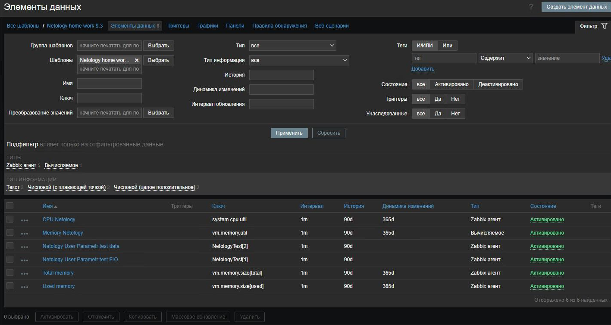
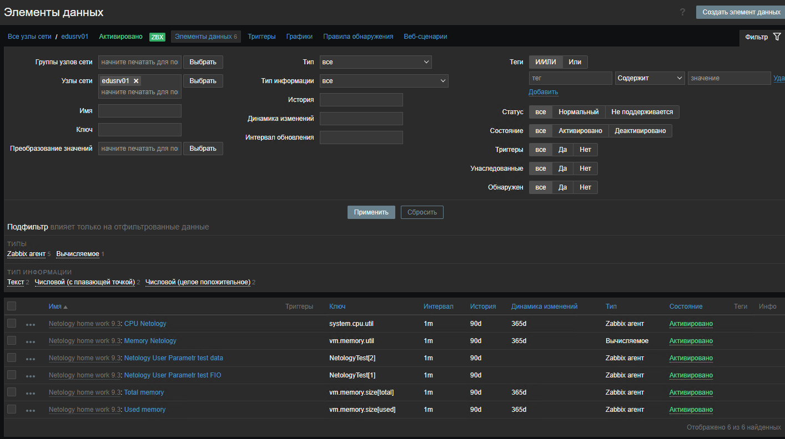
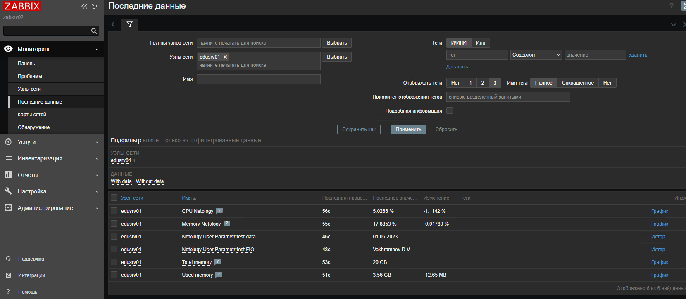

# Домашнее задание к занятию "9.3. Zabbix часть 2"

---

### Задание 1. 
Создайте свой шаблон, в котором будут элементы данных, мониторящие закгрузку CPU и RAM хоста.  
*Приведите скриншот вкладки Items вашего шаблона.*

---
### Задание 2. 
Привяжите созданный вами шаблон к хосту.  
*Приведите скриншот вкладки Items хоста, к которому прикреплён шаблон.*

---
### Задание 3.  
Создайте UserParameter, который будет возвращать в ответ на обращение вашу фамилию и инициалы, независимо от того, что ему отправлено на вход. Прикрепите его к хосту.
*Приложите скриншот раздела Latest data, где виден результат возвращаемый вашим UserParameter.*


---
## Дополнительные задания (со звездочкой*)  
---
### Задание 4*. 
Создайте свой UserParameter. Он должен вызывать какой-нибудь скрипт, который:
- при получении 1 будет возвращать ваши ФИО,
- при получении 2, будет возвращать текущую дату.  
*Приложите код скрипта.*
*Приложите скриншот Latest data с результатом работы скрипта.*
```
UserParameter=NetologyTest[*],PowerShell.exe -nologo "C:\Temp\test.ps1 $1"
```
```  
if ($args[0] -eq 1)
{
$String = "Vakhrameev D.V."
$String
}
else
{Get-Date -Format "MM/dd/yyyy"}
```
